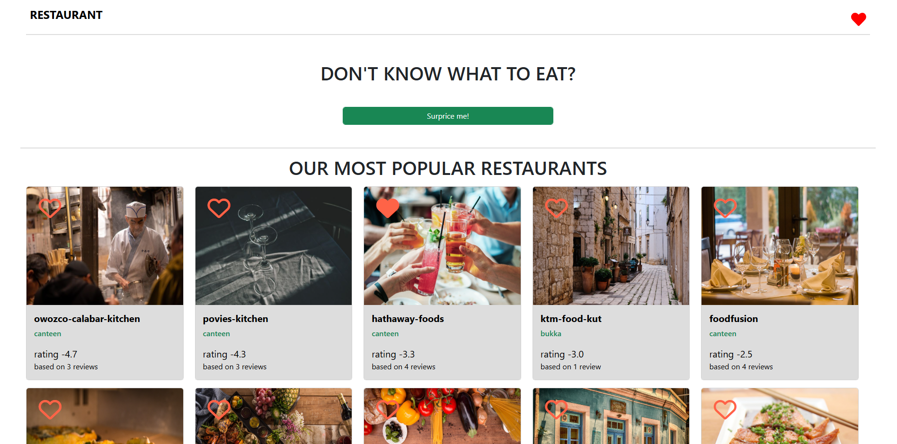

# Restaurants_Website



## **Restaurants_Website**

Looking for the perfect place to eat? This platform helps you discover a wide variety of restaurants, read real reviews from fellow diners, and find new favorites. Whether you're craving something familiar or want to try something new, we've got you covered.

- **Discover & Explore**: Browse through a curated list of restaurants and find the best places to satisfy your taste.
- **Add to Favorites**: Found a place you love? Simply add it to your favorites for easy access next time!
- **Share Your Experience**: Leave reviews to help others find their next great meal.
- **Surprise Me**: Can't decide what to eat? Let us surprise you with a random restaurant suggestion!

With a constantly updated list and real user feedback, it's easier than ever to find and enjoy your next dining adventure. Bon appétit!

## **Features**

- **Local storage:** The revies are stored Localy on the browser.
- **Screen Resolutions:** Optimized for screens with a resolution of 1920×1080px and automatically adapts to devices with predefined DPI scaling (e.g., 1.25 or higher) set at the operating system level.

## **Technologies Used**

- **React**: For building the user interface.
- **TypeScript**: For type safety and better code maintainability.
- **React Context API**: For state sharing across components.
- **Boostrap**: For styling.
- **CSS**: For enhanced CSS styling.

## **Setup and Installation**

### Prerequisites

- Node.js installed on your system.
- Basic knowledge of npm.

1. Clone the repository:

   ```bash
   https://github.com/IvanPejcinoski1/Restaurant_Website

   ```

2. Install dependencies: npm install
3. Start the development server:npm start.
